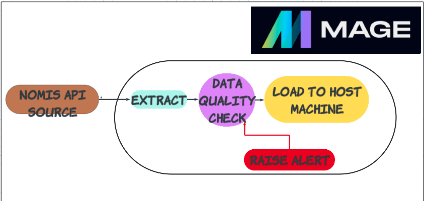
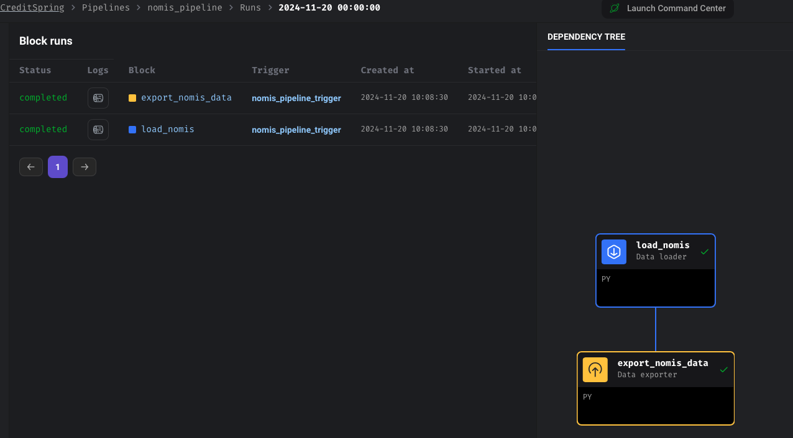
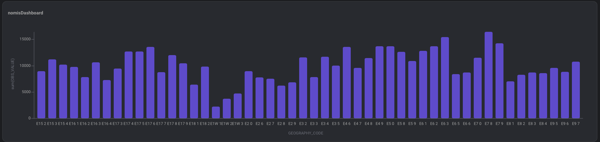
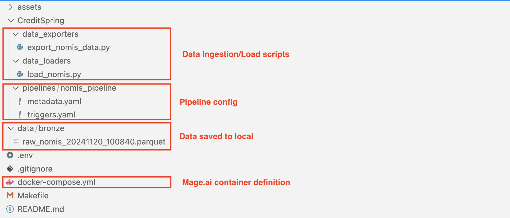

# Nomis Indicator Data Engineering Project 

A data engineering project that ingests highest level of qualification by postcode sector from the Nomis Inicator API and stores it in local drive 

## Table of Contents

* [Run Data Pipeline](#run-data-pipeline)
    * [Run Locally](#run-locally)
* [Architecture and Services](#architecture-and-services)


## Run Data Pipeline

Code available at **[nomis_data_pipeline](https://github.com/notiamoah-21/nomis_data_pipeline)** repository.

### Run Locally

To run the data pipeline locally, you need:

1. [Git](https://git-scm.com/book/en/v2/Getting-Started-Installing-Git)
2. [GitHub account](https://github.com/)
3. [Docker](https://docs.docker.com/engine/install/) with at least 4GB of RAM and [Docker Compose](https://docs.docker.com/compose/install/) v1.27.0 or later

Clone the repository and run the following commands to start the data pipeline:

```bash
git clone https://github.com/notiamoah-21/nomis_data_pipeline.git
cd nomis_data_pipeline
make up 
sleep 10 #wait for Mage.ai to start 
```

Go to [http:localhost:6789](http:localhost:6789) to see the Mage UI. 

## Architecture and Services

This data engineering project includes the following components:

1. **`Mage.ai`**: To schedule and orchestrate data pipeline.
2. **`Python`**: Employed to develop necessary data loader and data exporter scripts.
3.  **`Host machine`**:  Used to store raw data from the Nomis Indicator API. 

The Mage.ai service is installed and executed within a single container, as defined in the [Docker Compose configuration file.](./docker-compose.yml)



The `nomis_etl` pipeline in the [Mage UI](http://localhost:6769) will look like the below image: 



You can see the rendered dashboard from mage.ai as shown below:



The file structure of the repo is as shown below: 


